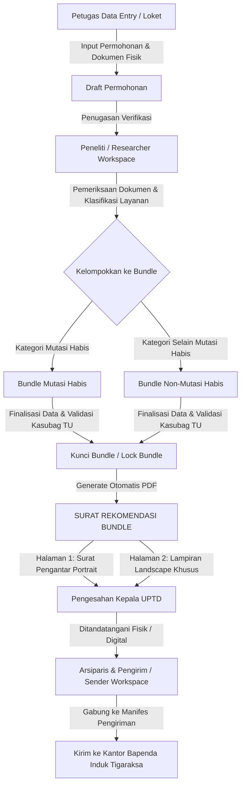
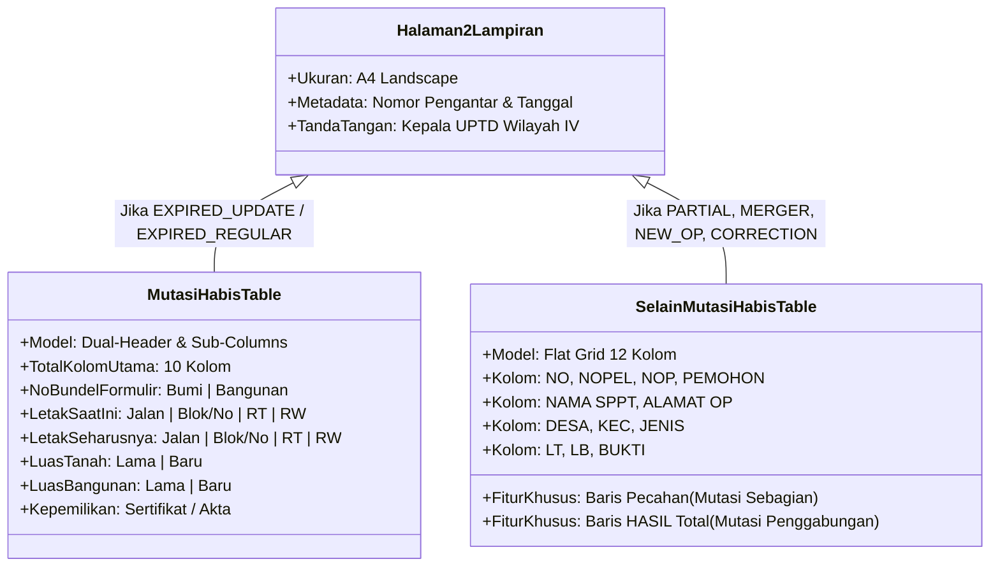

# PANDUAN LENGKAP & SPESIFIKASI DETAIL
## SURAT REKOMENDASI BUNDLE: MUTASI HABIS VS SELAIN MUTASI HABIS
### Sistem Pengelolaan Aplikasi, Bundle, dan Manifes PBB-P2 (Architax / Asana-Home)
**Unit Kerja:** Badan Pendapatan Daerah (Bapenda) Kabupaten Tangerang — UPTD Pajak Daerah Wilayah IV

---

## DAFTAR ISI
1. [Latar Belakang & Konteks Bisnis](#1-latar-belakang--konteks-bisnis)
2. [Peran Surat Rekomendasi dalam Siklus Hidup Berkas](#2-peran-surat-rekomendasi-dalam-siklus-hidup-berkas)
3. [Perbedaan Mendasar: Mutasi Habis vs Selain Mutasi Habis](#3-perbedaan-mendasar-mutasi-habis-vs-selain-mutasi-habis)
4. [Anatomi & Struktur Surat Halaman 1 (Portrait — Surat Pengantar)](#4-anatomi--struktur-surat-halaman-1-portrait--surat-pengantar)
5. [Anatomi & Struktur Surat Halaman 2 (Landscape — Lampiran Data Nominatif)](#5-anatomi--struktur-surat-halaman-2-landscape--lampiran-data-nominatif)
   - [5.1 Lampiran Khusus: Mutasi Habis (SP_Hal_2_MH)](#51-lampiran-khusus-mutasi-habis-sp_hal_2_mh)
   - [5.2 Lampiran Standar: Selain Mutasi Habis (SP_Hal_2)](#52-lampiran-standar-selain-mutasi-habis-sp_hal_2)
6. [Aturan Bisnis & Algoritma Khusus Sistem](#6-aturan-bisnis--algoritma-khusus-sistem)
7. [Contoh Visual Format Surat (Visual Mockup)](#7-contoh-visual-format-surat-visual-mockup)
   - [7.1 Contoh Halaman 1 (Surat Pengantar Rekomendasi)](#71-contoh-halaman-1-surat-pengantar-rekomendasi)
   - [7.2 Contoh Halaman 2: Mutasi Habis (Tabel Komparatif & Formulir Bumi/Bangunan)](#72-contoh-halaman-2-mutasi-habis-tabel-komparatif--formulir-bumibangunan)
   - [7.3 Contoh Halaman 2: Selain Mutasi Habis (Mutasi Sebagian, Penggabungan, dll.)](#73-contoh-halaman-2-selain-mutasi-habis-mutasi-sebagian-penggabungan-dll)
8. [Matriks Perbandingan Ringkas](#8-matriks-perbandingan-ringkas)

---

## 1. Latar Belakang & Konteks Bisnis

Di lingkungan administrasi Pajak Bumi dan Bangunan Perdesaan dan Perkotaan (PBB-P2) Pemerintah Kabupaten Tangerang, pelayanan tatap muka di kantor Unit Pelaksana Teknis Daerah (UPTD) Wilayah IV menerima berbagai permohonan pembetulan dan pemutakhiran data Surat Pemberitahuan Pajak Terutang (SPPT).

Agar berkas fisik dan data digital tertib, akuntabel, dan tidak tercecer saat dikirim ke Kantor Badan Pendapatan Daerah (Bapenda Induk / Bidang Pendataan, Penilaian, dan Penetapan), seluruh permohonan wajib dikelompokkan ke dalam satu wadah arsip bernama **Bundle**.

Setiap Bundle yang selesai diteliti oleh petugas verifikator (**Researcher**) dan siap dikunci (**Lock Bundle**) diterbitkan dokumen formal yang disebut **Surat Rekomendasi Bundle** (atau *Bundle Cover Letter* / *Surat Pengantar Rekomendasi Penetapan SPPT*). Dokumen ini berfungsi sebagai:
1. **Surat Pengantar Resmi Dinas**: Pengantar antar-unit dari Kepala UPTD Wilayah IV kepada Kepala Bapenda Cq. Kepala Bidang Pendataan, Penilaian, dan Penetapan Pajak Daerah.
2. **Berita Acara Hasil Penelitian Lapangan & Yuridis**: Pernyataan bahwa seluruh berkas dalam bundle telah diperiksa keabsahan alas hak tanah, kesesuaian subjek pajak, dan kelengkapan administrasinya.
3. **Instrumen Pengawasan & Kontrol Berkas**: Memuat daftar nominatif seluruh Nomor Pelayanan (NOPEL), Nomor Objek Pajak (NOP), wajib pajak lama vs baru, dan luas tanah/bangunan.

---

## 2. Peran Surat Rekomendasi dalam Siklus Hidup Berkas

Berikut adalah diagram alur posisi Surat Rekomendasi Bundle dalam sistem:



---

## 3. Perbedaan Mendasar: Mutasi Habis vs Selain Mutasi Habis

Dalam regulasi PBB-P2 Kabupaten Tangerang, permohonan dibagi ke dalam dua kelompok tata kelola cetak rekomendasi yang memiliki aturan tabel dan struktur informasi yang sangat berbeda:

### A. Mutasi Habis (`EXPIRED_UPDATE` & `EXPIRED_REGULAR`)
* **Konsep Yuridis**: Terjadi peralihan hak kepemilikan/penguasaan objek pajak secara **penuh (100%)** dari **1 Subjek Pajak Lama** kepada **1 Subjek Pajak Baru** untuk keseluruhan bidang NOP tersebut. Tidak ada sisa tanah di pemilik lama.
* **Sub-Jenis**:
  1. `EXPIRED_UPDATE` (*Mutasi Habis Update*): Balik nama penuh yang disertai perubahan fisik objek (misal: luas bangunan bertambah/berkurang, alamat disesuaikan, atau sertifikat baru diterbitkan).
  2. `EXPIRED_REGULAR` (*Mutasi Habis Reguler*): Balik nama penuh murni tanpa perombakan struktur fisik bangunan/tanah.
* **Kebutuhan Teknis Bapenda**:
  Membutuhkan **Lembar Verifikasi Komparatif** mendalam antara kondisi *Database Saat Ini (Lama)* vs kondisi *Hasil Penelitian Lapangan (Seharusnya / Baru)*, serta alokasi **Nomor Bundel Formulir Bumi & Bangunan** untuk pencatatan di berkas fisik Bapenda.

### B. Selain Mutasi Habis (`NON-MUTASI HABIS`)
* **Konsep Yuridis**: Layanan administrasi perpajakan yang memiliki variasi hubungan subjek-objek yang beragam (pemecahan, penggabungan, pembuatan baru, atau koreksi kesalahan).
* **Jenis Layanan yang Masuk Kategori Ini**:
  1. `PARTIAL_MUTATION` / `MUTASI_SEBAGIAN`: Satu objek induk dipecah menjadi beberapa bidang baru ($1 \to N$).
  2. `MERGER_MUTATION` / `MUTASI_PENGGABUNGAN`: Beberapa bidang objek digabung menjadi satu bidang baru ($N \to 1$).
  3. `NEW_TAX_OBJECT` / `OBJEK_PAJAK_BARU`: Pendaftaran NOP baru untuk tanah/bangunan yang belum pernah ada dalam basis data SISMIOP/PBB.
  4. `CORRECTION` / `PEMBETULAN`: Perbaikan ejaan nama, NIK, alamat objek, atau koreksi batas luas tanpa pergantian pemilik penuh.
  5. `REACTIVATION` / `PENGAKTIFAN`: Mengaktifkan kembali NOP yang sebelumnya terhapus atau non-aktif.
  6. `SALINAN_SPPT` & `PEMBATALAN`.
* **Kebutuhan Teknis Bapenda**:
  Menggunakan tabel lampiran nominatif standar 12 kolom yang fokus pada identitas pemohon, identitas SPPT lama, alamat objek lengkap dengan Desa dan Kecamatan, luas tanah/bangunan, dan bukti kepemilikan.

---

## 4. Anatomi & Struktur Surat Halaman 1 (Portrait — Surat Pengantar)

Halaman 1 untuk **kedua jenis bundle memiliki format kerangka yang seragam**, dicetak pada kertas **A4 Portrait**, berorientasi pada tata persuratan dinas resmi Pemkab Tangerang:

### Elemen-Elemen Halaman 1:
1. **Kop Surat Resmi**:
   - Logo Lambang Daerah Kabupaten Tangerang di sebelah kiri.
   - Baris 1: `PEMERINTAH KABUPATEN TANGERANG` (Font Bold, 13pt).
   - Baris 2: `BADAN PENDAPATAN DAERAH` (Font Bold, 15pt).
   - Baris 3: Alamat Perkantoran Komp. Tigaraksa, Telp/Fax, Website, & Email resmi.
   - Garis ganda pembatas kop surat (Tebal 2pt dan 0.75pt).
2. **Metadata Surat**:
   - **Nomor**: Mengambil nomor resmi Bundle (Contoh: `973/002-UPT.PD.WIL.IV/2026`).
   - **Lampiran**: Jumlah berkas permohonan yang ada di dalam bundle (Contoh: `25 Berkas`).
   - **Hal**: `Rekomendasi Permohonan [Jenis Layanan] SPPT Tahun [Tahun Berjalan]`
   - **Tanggal & Tempat**: `Tigaraksa, [Tanggal Update/Cetak Surat]`.
3. **Tujuan Surat (Kepada Yth)**:
   - Yth. Kepala Badan Pendapatan Daerah
   - Cq. Kepala Bidang Pendataan, Penilaian, dan Penetapan Pajak Daerah
   - di Tempat
4. **Paragraf Pembuka**:
   Menyatakan maksud penyampaian data permohonan hasil pelayanan tatap muka UPTD Wilayah IV untuk penetapan SPPT PBB tahun berjalan.
5. **Tabel Ringkasan Eksekutif (Tabel Halaman 1)**:
   Terdiri dari 4 kolom:
   - **NO AGENDA**: Diambil dari nomor urut bundle (Contoh: `002`).
   - **JENIS**: Nama resmi jenis permohonan (Contoh: `Mutasi Habis Update` atau `Mutasi Sebagian`).
   - **JUMLAH**: Total berkas (Contoh: `25 Berkas`).
   - **KETERANGAN**: `Rincian Berkas Terlampir`.
6. **Paragraf Penutup & Pernyataan Keabsahan**:
   Menyatakan bahwa berkas telah melalui proses penelitian, verifikasi lapangan/yuridis, dan diarsipkan sebagaimana mestinya.
7. **Blok Tanda Tangan Pejabat (Kanan Bawah)**:
   - Jabatan: `Kepala UPTD / KEPALA UNIT PELAKSANA TEKNIS`
   - Unit Kerja: `Pajak Daerah Wilayah IV / PAJAK DAERAH WILAYAH IV`
   - Ruang tanda tangan & cap stempel dinas.
   - Nama Pejabat: `ASEP SUANDI, SH., M.Si`
   - NIP: `19800630 200801 1 006`.

---

## 5. Anatomi & Struktur Surat Halaman 2 (Landscape — Lampiran Data Nominatif)

Perbedaan paling fundamental antara **Mutasi Habis** dan **Selain Mutasi Habis** terletak pada struktur tabel di **Halaman 2 (A4 Landscape)**.



---

### 5.1 Lampiran Khusus: Mutasi Habis (`SP_Hal_2_MH`)

Tabel lampiran Mutasi Habis dirancang khusus untuk membandingkan secara langsung (*side-by-side comparative*) data existing dalam database SISMIOP dengan data usulan baru dari pemohon, serta mencatat nomor formulir pendaftaran fisik.

#### Susunan Kolom Tabel Mutasi Habis:
| No Kolom | Nama Kolom Utama | Sub-Kolom | Lebar Relatif | Keterangan & Asal Data |
| :---: | :--- | :--- | :---: | :--- |
| **1** | NO | - | 2% | Nomor urut baris (1, 2, 3, ...) |
| **2** | NOPEL | - | 6% | Nomor Pelayanan (Contoh: `36.03.120.001...`) |
| **3** | **NO BUNDEL FORMULIR** | **Bumi** | 3% | Nomor urut bundel formulir tanah tahunan |
| | | **Bangunan** | 3% | Nomor urut bundel formulir bangunan (jika ada perubahan LB) |
| **4** | NOP | - | 11% | Nomor Objek Pajak 18 digit |
| **5** | WP LAMA | - | 8% | Nama Wajib Pajak yang tertera pada SPPT sebelumnya |
| **6** | WP BARU | - | 8% | Nama Wajib Pajak baru hasil mutasi penuh |
| **7** | **Letak Objek Saat Ini** *(Lama)* | **Jalan** | 10.5% | Nama jalan pada basis data SPPT lama |
| | | **Blok/No** | 5.0% | Blok kavling / nomor rumah lama |
| | | **RT** | 2.75% | Nomor Rukun Tetangga lama |
| | | **RW** | 2.75% | Nomor Rukun Warga lama |
| **8** | **Letak Objek Seharusnya** *(Baru)*| **Jalan** | 10.5% | Nama jalan sebenarnya hasil verifikasi |
| | | **Blok/No** | 5.0% | Blok kavling / nomor rumah baru |
| | | **RT** | 2.75% | Nomor RT baru |
| | | **RW** | 2.75% | Nomor RW baru |
| **9** | **Luas Tanah** | **Lama** | 2.5% | Luas bumi di SPPT lama (m²) |
| | | **Baru** | 2.5% | Luas bumi hasil ukur/sertifikat baru (m²) |
| **10** | **Luas Bangunan** | **Lama** | 2.5% | Luas bangunan di SPPT lama (m²) |
| | | **Baru** | 2.5% | Luas bangunan baru hasil pendataan (m²) |
| **11** | Kepemilikan | - | 7% | Jenis alas hak & nomor (Contoh: `SHM No. 04123`) |

> **Catatan Header Mutasi Habis:**
> Pada blok tanda tangan Halaman 2 Mutasi Habis, nomenklatur jabatan ditulis dalam huruf kapital penuh:
> **`KEPALA UNIT PELAKSANA TEKNIS PAJAK DAERAH WILAYAH IV`**

---

### 5.2 Lampiran Standar: Selain Mutasi Habis (`SP_Hal_2`)

Tabel lampiran selain mutasi habis menggunakan struktur tabel 12 kolom tunggal yang mampu menangani transaksi banyak-ke-banyak (pecahan atau gabungan):

#### Susunan Kolom Tabel Standar:
| No Kolom | Nama Kolom Header | Lebar Relatif | Deskripsi Isi Data |
| :---: | :--- | :---: | :--- |
| **1** | NO | 3% | Nomor urut berkas atau indeks pecahan (Contoh: `1`, `1.1`, `1.2`) |
| **2** | NOPEL | 9% | Nomor Pelayanan berkas |
| **3** | NOP | 13% | NOP 18 Digit (atau NOP Sementara untuk Objek Baru) |
| **4** | NAMA PEMOHON | 11% | Nama orang/badan yang mengajukan permohonan |
| **5** | NAMA SPPT | 11% | Nama yang tercantum pada lembar ketetapan SPPT lama |
| **6** | ALAMAT OP | 13% | Alamat lengkap objek pajak (Jalan, No, RT/RW) |
| **7** | DESA | 8% | Desa/Kelurahan letak objek pajak |
| **8** | KEC | 8% | Kecamatan letak objek pajak |
| **9** | JENIS | 10% | Jenis pelayanan formal (Mutasi Sebagian, Penggabungan, dll.) |
| **10** | LT | 4% | Luas Tanah (m²) |
| **11** | LB | 4% | Luas Bangunan (m²) |
| **12** | BUKTI | 6% | Alas hak bukti kepemilikan (SHM / HGB / AJB / Girik) |

#### Perlakuan Khusus Tiap Jenis Permohonan:
1. **Mutasi Sebagian (`PARTIAL_MUTATION`)**:
   - Jika satu NOP induk dipecah menjadi 3 kepemilikan baru, maka pada tabel lampiran akan dirender **3 baris terpisah**.
   - Kolom `NAMA PEMOHON` menampilkan nama masing-masing pemilik pecahan baru.
   - Kolom `NAMA SPPT` tetap menampilkan nama pemilik induk lama.
   - Kolom `LT` dan `LB` mencantumkan luas masing-masing kavling pecahan.
2. **Mutasi Penggabungan (`MERGER_MUTATION`)**:
   - Menampilkan rincian NOP-NOP asal terlebih dahulu dengan penomoran bertingkat (misal: `1.1`, `1.2`).
   - Diakhiri dengan satu baris resume bertanda **`HASIL`** atau baris sorotan khusus (*highlight*) yang menampilkan total Luas Tanah dan Luas Bangunan gabungan serta calon pemegang hak baru.
3. **Objek Pajak Baru (`NEW_TAX_OBJECT`)**:
   - Kolom NOP menampilkan **NOP Sementara** (*temporary NOP*) yang digenerate oleh sistem sebelum NOP definitif diterbitkan Bapenda Induk.
   - Kolom Nama SPPT dikosongkan atau diisi strip (`-`).

---

## 6. Aturan Bisnis & Algoritma Khusus Sistem

Di balik pembuatan dokumen PDF (`app/api/pdf/bundle-cover-letter/[id]/route.tsx`), terdapat beberapa algoritma bisnis krusial:

### A. Algoritma Penomoran Bundel Formulir Bumi & Bangunan (Mutasi Habis)
Untuk Mutasi Habis, sistem secara dinamis menghitung nomor formulir tahunan:
```typescript
// Direset setiap tahun kalender berjalan (1 Jan - 31 Des)
let counter = 1;
for (const p of allMutasiHabisYear) {
  const hasBuildingDiff = (prev.buildingArea || p.luasBangunanLama) !== (target.buildingArea || target.luasBangunanBaru || 0);
  
  // No Bumi selalu dialokasikan
  const noBumi = counter;
  counter += 1;

  // No Bangunan HANYA dialokasikan jika terdapat selisih luas bangunan lama vs baru
  let noBangunan: number | null = null;
  if (hasBuildingDiff) {
    noBangunan = counter;
    counter += 1;
  }

  mutasiHabisNumbersMap[p.id] = { noBumi, noBangunan };
}
```
* **Kaidah Bisnis**: Formulir SPOP (Surat Pemberitahuan Objek Pajak - Bumi) selalu wajib, sedangkan formulir LSPOP (Lampiran Surat Pemberitahuan Objek Pajak - Bangunan) hanya diisi jika terdapat penambahan, pengurangan, atau perubahan data bangunan.

### B. Algoritma Perhitungan Jumlah Berkas (`getJumlahBerkas`)
Jumlah berkas pada lampiran tidak selalu sama dengan jumlah baris database:
* Pada **Mutasi Sebagian**: Jumlah berkas dihitung dari **banyaknya data baru / target pecahan** (`targetData.length`), bukan dari 1 berkas induk.
* Pada **Mutasi Penggabungan**: Jumlah berkas dihitung dari **banyaknya NOP asal yang digabung** (`previousData.length`).
* Pada **Mutasi Habis & Jenis Lainnya**: Dihitung **1 permohonan = 1 berkas**.

### C. Parser Otomatis Alamat ke Elemen RT/RW & Blok (`parseAddress`)
Karena input alamat di modul pelayanan seringkali berupa satu string bebas (misal: `"JL. MAWAR INDAH NO. 12 RT 003/05"`), sistem memiliki modul parser regex otomatis yang mengekstrak komponen menjadi:
- `Jalan`: `"JL. MAWAR INDAH"`
- `Blok`: `"NO. 12"`
- `RT`: `"003"`
- `RW`: `"05"`

Hal ini memastikan tabel Halaman 2 Mutasi Habis terisi rapi pada sub-kolomnya masing-masing.

---

## 7. Contoh Visual Format Surat (Visual Mockup)

Berikut adalah representasi visual dokumen PDF yang dihasilkan oleh sistem.

### 7.1 Contoh Halaman 1 (Surat Pengantar Rekomendasi)
*(Format: Portrait A4 — Digunakan oleh semua jenis bundle)*

```
+-----------------------------------------------------------------------------------+
|  [LOGO PEMDA]           PEMERINTAH KABUPATEN TANGERANG                            |
|                            BADAN PENDAPATAN DAERAH                                |
|             Gedung Pendapatan Daerah Komp. Perkantoran Tigaraksa                  |
|                   Telp. (021) 599 88333 Fax. (021) 599 88333                      |
|         Website: bapendatangerangkab.go.id | Email: bapenda@tangerangkab.go.id    |
+===================================================================================+
|                                                                                   |
| Nomor     : 973/004-UPT.PD.WIL.IV/2026                 Tigaraksa, 15 Februari 2026|
| Lampiran  : 10 Berkas                                                             |
| Hal       : Rekomendasi Permohonan Mutasi Habis Update SPPT Tahun 2026            |
|                                                                                   |
| Yth. Kepala Badan Pendapatan Daerah                                               |
| Cq. Kepala Bidang Pendataan, Penilaian, dan Penetapan Pajak Daerah                 |
| di                                                                                |
| TEMPAT                                                                            |
|                                                                                   |
| Dipermaklumkan dengan hormat, bersama ini kami sampaikan data permohonan          |
| Mutasi Habis Update SPPT PBB Tahun 2026 pada pelayanan tatap muka UPTD            |
| Wilayah IV sebagai berikut:                                                       |
|                                                                                   |
| +-----------+-----------------------------+---------------+---------------------+ |
| | NO AGENDA |            JENIS            |    JUMLAH     |     KETERANGAN      | |
| +-----------+-----------------------------+---------------+---------------------+ |
| |    004    |     Mutasi Habis Update     |   10 Berkas   | Rincian Terlampir   | |
| +-----------+-----------------------------+---------------+---------------------+ |
|                                                                                   |
| Sehubungan dengan hal ini, bahwa berkas permohonan Mutasi Habis Update SPPT       |
| PBB tersebut sudah melalui proses penelitian/verifikasi dan diarsipkan            |
| sebagaimana mestinya (data terlampir).                                            |
|                                                                                   |
| Demikian surat rekomendasi ini kami sampaikan, atas perhatiannya diucapkan        |
| terimakasih.                                                                      |
|                                                                                   |
|                                                     Kepala UPTD                   |
|                                                     Pajak Daerah Wilayah IV       |
|                                                                                   |
|                                                             ( TTD & CAP )         |
|                                                                                   |
|                                                     ASEP SUANDI, SH., M.Si        |
|                                                     NIP. 19800630 200801 1 006    |
+-----------------------------------------------------------------------------------+
```

---

### 7.2 Contoh Halaman 2: Mutasi Habis (Tabel Komparatif & Formulir Bumi/Bangunan)
*(Format: Landscape A4 — Khusus `EXPIRED_UPDATE` & `EXPIRED_REGULAR`)*

```
Lampiran
Nomor Pengantar : 973/004-UPT.PD.WIL.IV/2026
Tanggal         : 15 Februari 2026

+--+------+-------------+-------------------+--------+--------+------------------------+------------------------+-----+-----+-----+-----+---------------+
|  |      |  NO BUNDEL  |                   |        |        |  Letak Objek Saat Ini  | Letak Objek Seharusnya | Luas Tanah|Luas Bangunan|               |
|NO|NOPEL |  FORMULIR   |        NOP        |WP LAMA |WP BARU |        (Lama)          |         (Baru)         |  (m2)     |    (m2)     |  Kepemilikan  |
|  |      +------+------+                   |        |        +--------+----+---+----+ +--------+----+---+----+ +-----+-----+-----+-----+               |
|  |      | Bumi | Bang |                   |        |        | Jalan  |Blok|RT |RW | | Jalan  |Blok|RT |RW | |Lama |Baru |Lama |Baru | (Sertifikat)  |
+--+------+------+------+-------------------+--------+--------+--------+----+---+----+ +--------+----+---+----+ +-----+-----+-----+-----+---------------+
| 1|26.012|  1   |  2   |36.03.120.001.002..|H. MAHRUF|SUHENDRA|JL MELATI|B.3|001|004|JL MELATI|B.3|001|004| 120 | 120 | 45  | 85  |SHM No. 01245  |
| 2|26.015|  3   |  -   |36.03.120.001.005..|SITI A. |BAMBANG |JL MAWAR |A.1|002|004|JL MAWAR |A.1|002|004| 200 | 200 | 90  | 90  |AJB No. 88/2025|
| 3|26.019|  4   |  5   |36.03.120.002.011..|PT. ABC |H. ANWAR|JL RAYA  |K.2|004|001|JL RAYA  |K.2|004|001| 500 | 480 | 150 | 220 |SHGB No. 00412 |
+--+------+------+------+-------------------+--------+--------+--------+----+---+----+ +--------+----+---+----+ +-----+-----+-----+-----+---------------+

                                                                    KEPALA UNIT PELAKSANA TEKNIS
                                                                    PAJAK DAERAH WILAYAH IV


                                                                        ( TTD & STEMPEL )


                                                                    ASEP SUANDI, SH., M.Si
                                                                    NIP. 19800630 200801 1 006
```

> **Keterangan Contoh Mutasi Habis Di Atas:**
> - **Baris 1**: Terjadi perubahan luas bangunan dari 45 m² menjadi 85 m² $\to$ Diberikan **No Bumi: 1** dan **No Bangunan: 2**.
> - **Baris 2**: Luas bangunan tetap 90 m² (tidak ada perubahan) $\to$ Diberikan **No Bumi: 3**, sedangkan kolom Bangunan diberi tanda strip (`-`).
> - **Baris 3**: Luas tanah dan bangunan berubah $\to$ Diberikan **No Bumi: 4** dan **No Bangunan: 5**.

---

### 7.3 Contoh Halaman 2: Selain Mutasi Habis (Mutasi Sebagian, Penggabungan, dll.)
*(Format: Landscape A4 — Digunakan untuk `PARTIAL_MUTATION`, `MERGER_MUTATION`, `NEW_TAX_OBJECT`, `CORRECTION`, dll.)*

#### A. Contoh Mutasi Sebagian (1 Objek Induk Pecah Menjadi 3 Kavling Pemilik Baru)
```
Nomor   : 973/007-UPT.PD.WIL.IV/2026
Tanggal : 18 Februari 2026

+---+---------+--------------------+---------------+---------------+--------------------+---------+---------+---------------+----+----+---------------+
|NO |  NOPEL  |        NOP         | NAMA PEMOHON  |   NAMA SPPT   |     ALAMAT OP      |  DESA   |   KEC   |     JENIS     | LT | LB |     BUKTI     |
+---+---------+--------------------+---------------+---------------+--------------------+---------+---------+---------------+----+----+---------------+
| 1 | 26.0411 | 36.03.140.005.011..| RIZKY ADITYA  | HJ. NURHASANAH| JL. FLAMBOYAN NO.12| KADU    | CURUG   |Mutasi Sebagian| 90 | 45 |SHM No. 05411  |
| 2 | 26.0411 | 36.03.140.005.011..| DANI FIRDAUS  | HJ. NURHASANAH| JL. FLAMBOYAN NO.14| KADU    | CURUG   |Mutasi Sebagian| 90 | 45 |SHM No. 05412  |
| 3 | 26.0411 | 36.03.140.005.011..| SISKA AMALIA  | HJ. NURHASANAH| JL. FLAMBOYAN NO.16| KADU    | CURUG   |Mutasi Sebagian| 120| 60 |SHM No. 05413  |
| 4 | 26.0489 | 36.03.140.008.002..| H. RIDWAN     | SUKIRMAN      | KP. BUGEL RT 02/01 | CURUG K.| CURUG   |Pembetulan     | 250| 100|Girik C. 412   |
+---+---------+--------------------+---------------+---------------+--------------------+---------+---------+---------------+----+----+---------------+

                                                                    Kepala UPTD
                                                                    Pajak Daerah Wilayah IV


                                                                        ( TTD & STEMPEL )


                                                                    ASEP SUANDI, SH., M.Si
                                                                    NIP. 19800630 200801 1 006
```

#### B. Contoh Mutasi Penggabungan (2 Bidang Tanah Digabung Menjadi 1 Bidang)
```
Nomor   : 973/009-UPT.PD.WIL.IV/2026
Tanggal : 20 Februari 2026

+-----+---------+--------------------+---------------+---------------+--------------------+---------+---------+--------------------+----+----+-------------+
| NO  |  NOPEL  |        NOP         | NAMA PEMOHON  |   NAMA SPPT   |     ALAMAT OP      |  DESA   |   KEC   |       JENIS        | LT | LB |    BUKTI    |
+-----+---------+--------------------+---------------+---------------+--------------------+---------+---------+--------------------+----+----+-------------+
| 1.1 | 26.0650 | 36.03.120.008.014..| AGUS PRASETYO | AGUS PRASETYO | JL. CEMPAKA NO. 4  | BOJONG  | CIKUPA  |Mutasi Penggabungan | 150| 60 |SHM No. 101  |
| 1.2 | 26.0650 | 36.03.120.008.015..| AGUS PRASETYO | H. BAHRUDIN   | JL. CEMPAKA NO. 6  | BOJONG  | CIKUPA  |Mutasi Penggabungan | 150| 0  |AJB No. 44   |
|HASIL| 26.0650 | 36.03.120.008.014..| AGUS PRASETYO |(Penggabungan) | JL. CEMPAKA NO. 4-6| BOJONG  | CIKUPA  |Mutasi Penggabungan | 300| 60 |SHM No. 101  |
+-----+---------+--------------------+---------------+---------------+--------------------+---------+---------+--------------------+----+----+-------------+
```

---

## 8. Matriks Perbandingan Ringkas

| Parameter Pembeda | Surat Rekomendasi Mutasi Habis | Surat Rekomendasi Selain Mutasi Habis |
| :--- | :--- | :--- |
| **Kode Jenis Aplikasi** | `EXPIRED_UPDATE`, `EXPIRED_REGULAR` | `PARTIAL_MUTATION`, `MERGER_MUTATION`, `NEW_TAX_OBJECT`, `CORRECTION`, `REACTIVATION` |
| **Karakter Alih Hak** | 1 Subjek Lama $\to$ 1 Subjek Baru (100% Penuh) | Pecahan ($1 \to N$), Gabungan ($N \to 1$), Pendaftaran Baru, atau Koreksi Data |
| **Orientasi Halaman 1** | A4 Portrait (Surat Pengantar & Ringkasan Agenda) | A4 Portrait (Surat Pengantar & Ringkasan Agenda) |
| **Orientasi Halaman 2** | A4 Landscape (Tabel Komparatif Khusus) | A4 Landscape (Tabel Nominatif Standar) |
| **Format Header Tabel Hal. 2** | **Double Header Bertingkat** dengan Sub-Kolom | **Single Header** 12 Kolom Standar |
| **Kolom Nomor Formulir** | **Ada** (Sub-kolom No Bundel Formulir Bumi & Bangunan) | **Tidak Ada** |
| **Pemisahan Elemen Alamat** | **Terspesifikasi** (Sub-kolom: Jalan, Blok/No, RT, RW) | **Disatukan** dalam 1 kolom `ALAMAT OP` |
| **Perbandingan Luas** | Membandingkan **Lama vs Baru** untuk Tanah & Bangunan | Hanya menampilkan Luas Tanah (`LT`) & Luas Bangunan (`LB`) hasil |
| **Perhitungan Jumlah Berkas** | $1 \text{ Permohonan} = 1 \text{ Berkas}$ | Pada Mutasi Sebagian: dihitung berdasarkan jumlah target pecahan ($N$ Berkas) |
| **Nomenklatur Jabatan Hal. 2**| `KEPALA UNIT PELAKSANA TEKNIS PAJAK DAERAH WILAYAH IV` | `Kepala UPTD Pajak Daerah Wilayah IV` |
| **Endpoint PDF Terkait** | `GET /api/pdf/bundle-cover-letter/[id]` | `GET /api/pdf/bundle-cover-letter/[id]` |
| **Komponen UI Pengakses** | `RecommendationPrintView.tsx`, `useRecommendationPrint.ts`, `BundleHistoryDetailView.tsx` | `RecommendationPrintView.tsx`, `useRecommendationPrint.ts`, `BundleHistoryDetailView.tsx` |

---
*Dokumen ini disusun sebagai pedoman teknis dan operasional resmi sistem ARCHITAX / Asana-Home Badan Pendapatan Daerah Kabupaten Tangerang.*
